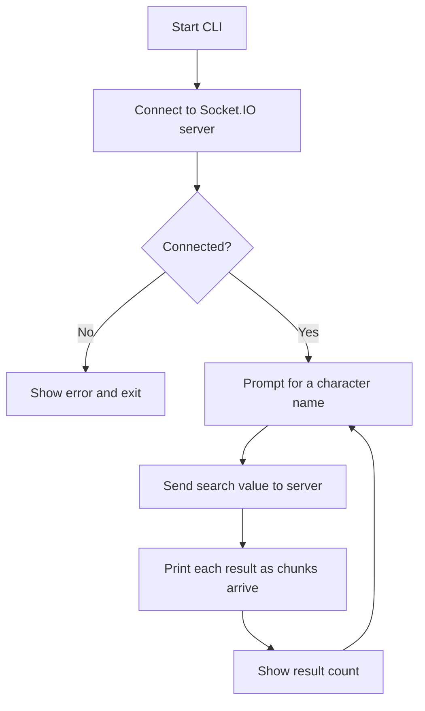

# Star Wars Character Search CLI

TypeScript CLI for the Valstro assessment: a Socket.IO client that searches Star Wars characters by name and prints streamed results. It also includes a wikipedia link for each found character to get more info.

## Getting started

**Prerequisites:** Node.js 18+ and Docker.

**1. Start the backend server** (leave it running):

```bash
docker run -p 3000:3000 aaronbate/socketio-backend
```

**2. Install and run the client** (separate terminal):

```bash
npm install
npm start
```

**Basic use:** After you connect, the app prompts for a character. Type a full or partial name (e.g. `luke`, `dar`) and press Enter. Matches arrive in chunks as the server sends them. Errors and “no results” are shown and you can search again without restarting. Use `Ctrl+C` to exit. Optional Wikipedia search links are printed per result for extra reading.

**Other commands:**


| Command         | Description                   |
| --------------- | ----------------------------- |
| `npm run build` | Compile TypeScript to `dist/` |
| `npm test`      | Run unit tests                |


---

## Architecture

```
src/
  index.ts          # entry: runs the app
  app.ts            # Socket.IO connect + readline loop → searchCharacters()
  config.ts         # server URL, timeouts, layout width, hints
  types.ts          # SearchResult / SearchError + isError()
  links/
    wikipedia.ts    # Wikipedia search URL helper
  socket/
    searchCharacters.ts # emit/listen `search`, streaming + timeout + cleanup
    index.ts        # public exports for the socket layer
  ui.ts             # console output (banner, prompts, result cards, errors)
```

### App flow

Connect once, then loop: **prompt → search → print streamed results → summary → prompt again**.


 The diagram above shows the happy path. The client also uses an **idle timeout** (if the server stops sending chunks), rejects on **disconnect mid-search**; in those cases the current search fails with a message and you can **prompt again** without restarting the app.

**Tests:** `socket/searchCharacters.test.ts` uses a fake `EventEmitter` socket.

**Basic CI:** `.github/workflows/ci.yml` runs `npm ci`, `npm run build`, and `npm test` on pushes and PRs to `main`.